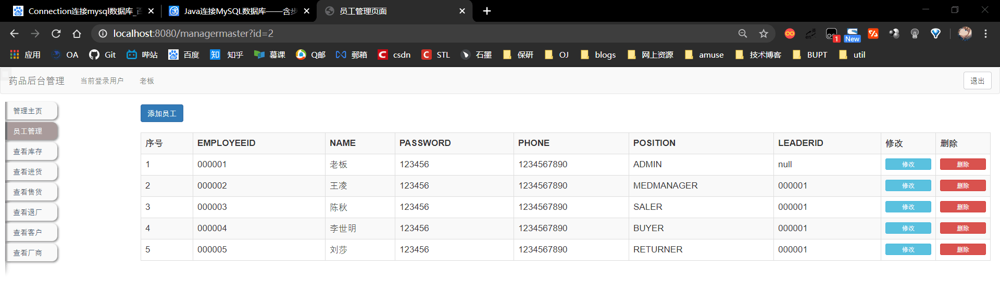

# Drug Managing System
帮兄弟写的大作业，虽然他可能用不上: )
这四个小时学到的东西还挺多的：)
##### 技术栈：JavaEE + MySQL(第一次用Connection连接数据库) + BootStrap前端
参考了一些比较成熟的设计，比如前端全部用别人的，后端很多组件也用别人的。
不过别人写了一堆bug，把一些严重的改得能用了。
部分文档在这里面：
https://shimo.im/docs/WhjD8XGDytgcPdDR/
部分前端：
