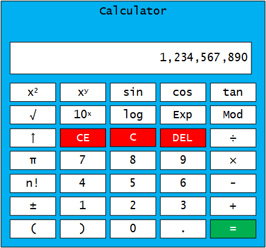

# Web前端开发技术-作业1

班级: 此处填写完整的班号

学号: 此处填写完整的学号

姓名: 此处填写姓名



使用HTML和CSS实现上图所示的计算器静态页面, 注意本次作业不使用JavaScript.

注意事项:

- 作业以Markdown方式提交, 本文档即是作业的模板.
  - 提交时将文件名改为: FWD2020HW1-班级-学号-姓名.md
- 源码中只能自己编写HTML和CSS, 不能使用任何第三方的库或者模板.
- 源码中不能使用任何图片, 界面中所有符号都使用代码形式, 非键盘字符使用Unicode字符.
- 源码粘贴在Markdown文件中以代码块形式提交, 可以参见下面的calc.html和calc.css的样式.
- 作业提交截止时间: 2020年3月18日23点59分之前.
- 作业提交到: buptne@gmail.com,
  - 邮件标题: FWD2020HW1-班级-学号-姓名
  - 附件名称: FWD2020HW1-班级-学号-姓名.md

## 程序源码

**calc.html**

```xml
<!DOCTYPE html>
<html>
    ...文件内容...
</html>
```

**calc.css**

```css
* {
    font-family: mono;
}
... 文件内容...
```

